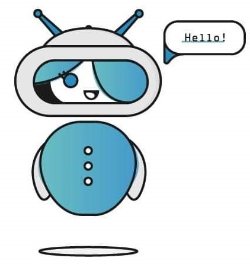
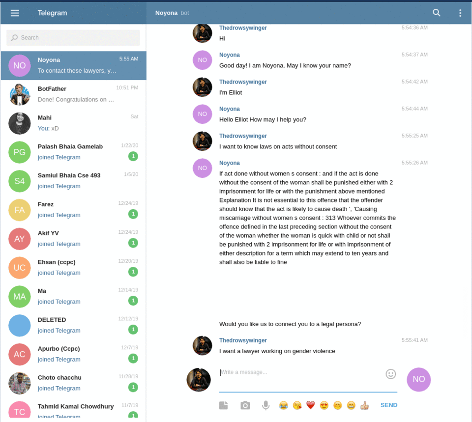

# Banglalink SGD Hackathon Winner Legal Assistant Chatbot

Noyona is an end to end product to help women with legal support by matching them with legal services using our NLP based chatbot made with Google Dialogflow. This project was created in second edition of Banglalink SDG Hackathon ["Code for a Cause"](https://www.banglalink.net/en/about-us/media/press-release/code-for-a-cause) a 24-hour hackathon aimed at encouraging young problem solvers to come up with innovative solutions to socio-economic challenges related to Sustainable Development Goals (SDG).

# Features

* Conversational Chatbot built with Dialogflow for interacting with end users
* Flask based backend app for matching users with legal services
* Dialogflow knowledge base question answering feature used for common law related questions
* SOS features routing users to hotline numbers for emergency support.

# Technical details 

The conversational interface of the product was built with Google Dialogflow and deployed to Slack and Telegram platforms immediately. The backend is a python web app built with Flask which use unsupervised nearest neighbor based recommender to match users with legal services. Dialogflow fulfilment requests are routed to the flask backend served from our local machine via ngrok. `app.py` script contains the flask app for the chatbot and model directory contains the notebook for building the recommender model from demo text data collected manually. 

# Demo

## Slack Chatbot Conversation demonstration : 

## Dialogflow web demo 

# Team

* [Tahsin Mayeesha](https://github.com/Tahsin-Mayeesha)
* [Abdullah Md Sarwar](https://github.com/thedrowsywinger)
* [Sayeed Shaiban](https://github.com/sayeedk06) 

# Final Demo Slides

[link](https://www.slideshare.net/mayeeshatahsin/banglalink-sgd-hackathon-final-demo) 

